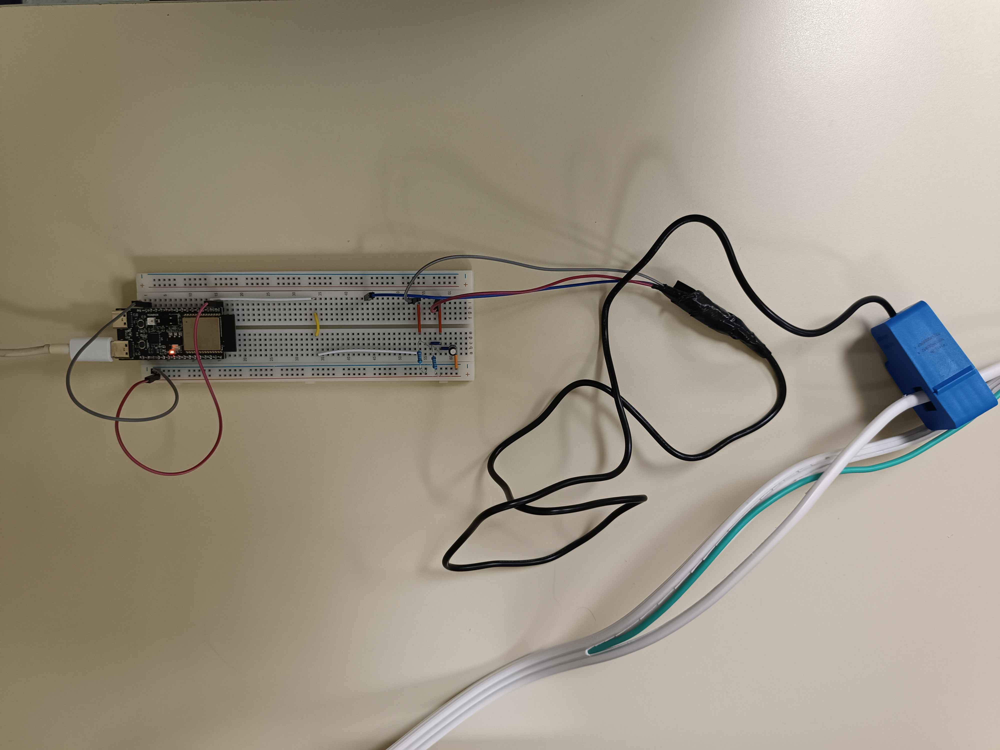

# JPFMonitoringPlugin
___
## Purpose
The JPFMonitoringPlugin is a small plugin that add a worldsubsystem that read a COM port of your computer to monitore the energy consumption of an Unreal Engine game using the **Joule per Frame** unit.

This plugin is intended to be used by pair with an arduino setup that read power consumption. In our cas we used a SCT013 captor paired with an ESP32-C6-DevKitC-1 to do so.


<br>

This is the code running on the esp32:

```cpp
#include <math.h>
#include "EmonLib.h"

const int ADC_INPUT = A4;
EnergyMonitor emon1;
double Irms, thePower;

void setup()
{
  Serial.begin(9600);
  emon1.current(ADC_INPUT, 30);
}

void loop()
{
  Irms = emon1.calcIrms(1480);
  thePower = Irms*115.0;
  Serial.printf("%d.%d\n",(int)thePower,((unsigned int)(thePower*100))%100);
  delay(30);
}
```

___
## Results

When running, the plugin generate `csv` files that contain 3 values:
- **Time** Accumulated time from the `DeltaTime` of the tick function of the subsystem.
- **Power** Consumption of the computer fetch from the COM port (and the arduino)
- **FPS** The frame rate of the game at this time (*calculated from `DeltaTime`, see [`DataStreamingSubsystem.cpp`](Source\JPFMonitoringPlugin\Private\DataStreamingSubsystem.cpp) tick function*)

Once the `CSV` is generated, you can generate plot both python scripts in `Resources/automation/AutoPlotter_JPF/`.

> To ensure an eazy comprehension of these script, both support the command `scriptname.py -h` to display a description and usage about the script.

#### AutoPlotter
The script [`auto_plotter.py`](Resources\automation\AutoPlotter_JPF\auto_plotter.py) for JPFMonitoringPlugin is a tool to generate a plot of the 'Joule/FPS' ratio over time from the CSV file generated by the JPFMonitoringPlugin.<br>
**⇒ USAGE** : `python auto_plotter.py [-rw=<rolling_window_size>] [-d or -b] <path>`

Options:
- `-rw=<rolling_window_size>` Set the rolling window size (default: 5)
- `-d` The following `<path>` is a directory and all direct CSV files in it will be processed.
- `-b` The following `<path>` is a directory and the script will processe all direct CSV file as **a benchmark** and will produce a unique plot with 3 curves: min, avg and max joule/frame. It will also produce the resulting csv file with the following keys : `Time`, `MinJPF`, `AvgJPF` and `MaxJPF`. This kind of csv file can be used in the `PlotterMatcher` script to compare two benchmark with ease.

Params:
- `<path>` The path to a CSV file or directory containing CSV files if -d is set

Example of result given by the script using single target:


<br>
Example of result given by the script using the benchmark option (`-b`):


#### PlotterMatcher
The script [`plotter_matcher.py`](Resources\automation\AutoPlotter_JPF\plotter_matcher.py) for JPFMonitoringPlugin is a tool to generate a single plot of the 'Joule/FPS' ratio over time from two CSV file generated by the JPFMonitoringPlugin allowing you to compare them with ease.<br>
**⇒ USAGE** : `python plotter_matcher.py` *This script use a wizard so no args are needed*

Example of result given by the script:

